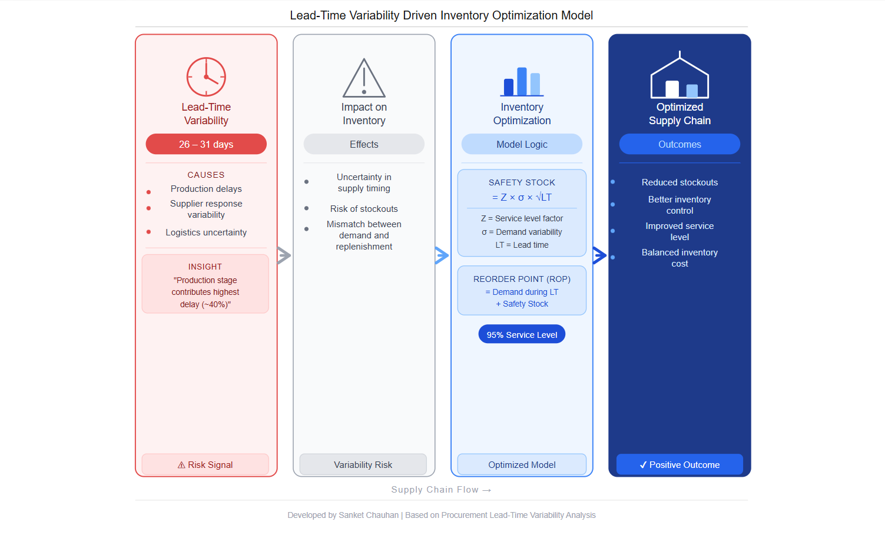

# 📊 Inventory Optimization Model

## 📌 Overview

This project focuses on optimizing inventory levels using safety stock and reorder point concepts to balance demand variability and supply uncertainty.

It demonstrates how effective inventory planning reduces stockouts and improves service levels.

📍 Use Case: Applicable to retail, manufacturing, and distribution supply chains

---

## 📊 Model

➡️ The model uses:

* Safety Stock calculation
* Reorder Point (ROP)
* Demand variability
* Lead-time variability

To ensure optimal inventory levels.

---

## 🎯 Objectives

* Reduce stockouts
* Optimize inventory holding levels
* Improve service level performance

---

## 🔍 Key Insights

* Higher variability increases safety stock requirements
* Accurate demand forecasting improves inventory control
* Proper reorder point prevents stock shortages
* Balanced inventory reduces excess holding costs

---

## 💼 Business Impact

* Improved inventory control
* Reduced holding and shortage costs
* Better customer service levels
* Efficient stock management

---

## ⚙️ Tools & Concepts Used

* Safety Stock Model
* Reorder Point (ROP)
* Demand & Lead-Time Variability
* Inventory Optimization Techniques

---

## 👤 Author

Sanket Chauhan
